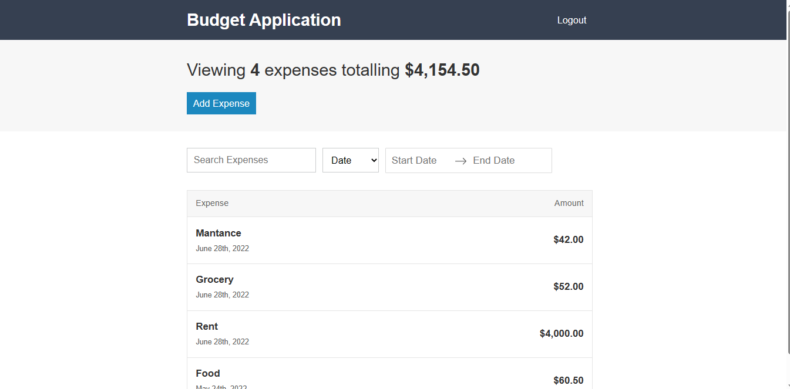

## Budget App Using React

Here, you can calculate your `Budget` according to your `Expense` on Monthly Basis.

---

### Demo project view



---

### For Setup:

1. clone this project.
    ````javascript
        git clone https://github.com/kaushikbhadra/budget-app-using-react.git
    ````
2. Install `Yarn:1.22.17` and `Node:14.15.4` then,
    ````javascript
        yarn install
    ````
3. Run `npm`
    ````javascript
        npm run build:prod
        npm run start
    ````
4. Done! and Enjoy. and deploy your choosen `host`

---

### Live Project Link

Link:  [Check Budget](https://budget-app-using-react.web.app/).
